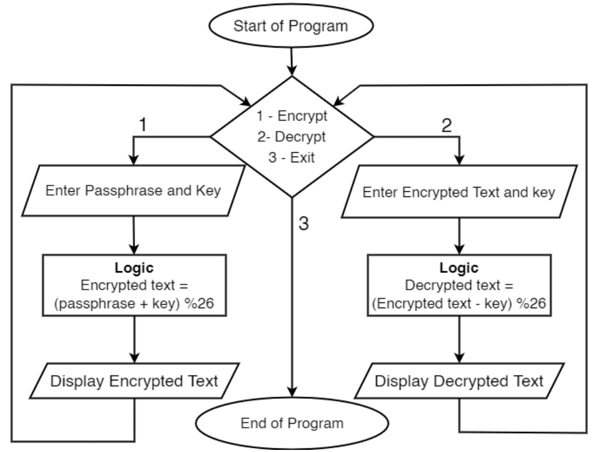

# Vigenere Cipher

## Introduction
Vigenère cipher is a form of polyalphabetic cipher used for encryption and decryption of text. It was first described by Giovan Battista Bellaso, Italian Cryptographer, in 1553. The working of Vigenère cipher can be explained from the Caeser cipher. While in Caeser cipher, every letter is shifted by same number of places, in the Vigenère cipher every letter is shifted by a different value corresponding to its key.

The C-Program gives the user to choose the option to either or to decrypt a message or to exit the program. Once the option has been chosen, the user will be prompted to enter the key1 for the process of encryption and decryption and, also the passphrase2
for encryption or ciphertext3 for decryption.

## How does Vigenère Cipher work?
Vigenère Cipher is known to be one of the best-known multi-letter ciphers (Sami & Mahmood, 2020). Vigenère Cipher is an extended Caeser cipher. It consists of set of multiple Caeser cipher substitutions on the plaintext. It can be easily understood from the Vigenère Table in Figure 1. The first row of table consists of the 26 English alphabets. Following rows are filled by applying Caeser cipher on the preceding row.

Vigenère cipher encryption is done by aligning the keyword to the plaintext. If the length of the key is shorter than the length of the plaintext, then the key would be repeated from the beginning. Ciphertext is obtained from the using the characters corresponding to the intersection of character in the plaintext and key from the Vigenère table

### Formula for Encryption and Decryption
Ciphertext and plaintext can be obtained by Vigenère cipher by simple process of modular addition and modular subtraction of the text with the repeating key. The mathematical formula for the Vigenère cipher is as follows:

The formula for the process of encryption is : C(n) = (P(n) + K(n)) mod 26 \
C(n) => nth letter of cipher text \
P(n) => nth letter of plain text \
K(n) => nth letter of key \

The formula for the process of decryption is:\
P(n) = (C(n) – K(n)) mod 26 \
P(n) => nth letter of plain text \
C(n) => nth letter of cipher text \
K(n) => nth letter of key

In both the formulas, the sum and difference are mod with 26 to get the value in the correct range as we only have 26 alphabets while the sum or difference might go out of this range, hence mod 26 helps the ciphertext stay in the correct range.

## Flowchart of the Program

The flowchart above explains the working of the C program below. At the start of the program, user will be prompted to select the option of encryption or decryption or exit.\
• If user selects the option to encrypt, program-pointer4 goes to the left part of the flowchart. User will be asked to enter the passphrase to be encrypted and the key for encryption. After that encryption logic will be applied and the resultant encrypted text will be displayed.\
• If user selects the option to decrypt, program-pointer goes to the right part of the flowchart. User will be asked to enter the ciphertext to be decrypted and the key for decryption. After that decryption logic will be applied and the resultant decrypted text will be displayed.\
At the end of the part of the selected option, program-pointer returns to the start of the program and user will have to same option to choose from. If the user chooses option 3 ( Exit ) the program-pointer will go to end of program and program will end.

### Sample Output

## Robustness of Vigenère Cipher

Ever since the Vigenère cipher was created in the 16th century it was considered invincible for 3 centuries. During this period, it was even called “le chiffre indéchiffrable”, literally meaning “the unbreakable cipher". But the unbreakable cipher was broken by a British Cryptographer and “the Father of Computing”, Charles Babbage, in the year 1854.

Babbage found that the vulnerability of the Vigenère cipher lied in its repetition of key. He found that whenever a word gets repeated in plaintext and lined up with the key in the similar manner, then characters would repeat at the same position in the cipher text, giving hint to the length of the key which makes it easier for attackers to guess the key once they know its length.

The above table shows explains how the Vigenère cipher can be cracked. The plain text used is “It is what it is” and keyword used is "code”. Since the phrase “it is” is repeated twice in the plain text and lines up perfectly with the key, so the text “KHLW” is repeated in the ciphertext at the same positions as phrase in the plaintext. As the text in ciphertext is repeated 8 letters apart, it can be guessed that the key’s length will be of the factor of 8.
Possible lengths of the key are: 1,2,4,8. Key can’t be of length 1 as it would make the cipher a common Caesar cipher, among 2,4 and 8 key can be found by analysing the ciphertext.

Even though Babbage was able to break the Vigenère cipher, there are limitations to his findings too. He found that one could break the cipher by spotting repetition of streams in the ciphertext and guess the length of password due to repetition of keyword, but even if one was able to randomly generate a key as the same length of the passphrase or long enough key that it is not repeated more than once, then the cipher becomes theoretically unbreakable. It also becomes hard to crack the cipher if there are less or no repetition of words in the plaintext